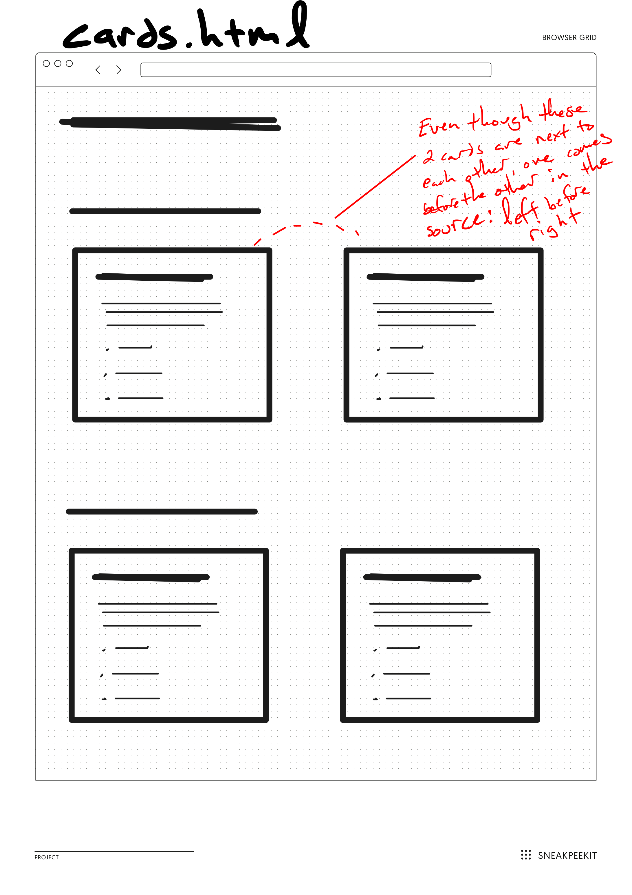

# Practicing Quick Components and HTML Structures

You will start this exercise on your own, and we will add to it within class.

## Goals

- Practice setting up and writing HTML pages through repetition
- Practice HTML element semantics, using the appropriate elements for sections and content
- Keep practicing default "flow" of HTML elements
- Practice grouping and nesting elements to produce semantically meaningful components on a page

## Logistics

- Create `card.html` within **your** folder. For me, this looks like the following:
     - `3-quick-components/lindgren/cards.html`

## Directions

Before your start this exercise, watch this [UX Club video](https://www.youtube.com/watch?v=ykHClgOUUj8&ab_channel=UXClub.com) about wireframes, so you can know how to interpret my wireframe below.

Create a page for each of the wireframes below. There's only 1 to complete before class.

Be sure to create a complete HTML page for each one with a `doctype`, `html`, `head`, and `body`.

### `cards.html`

### More to come in class ...

Wait to submit your exercise until after class.